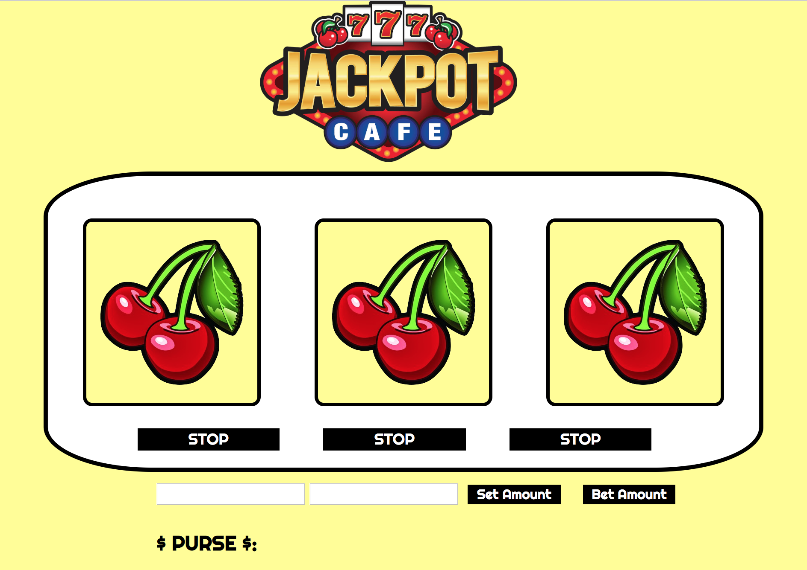

# Winner, Winner, Vegan Dinner!
This project is a slot machine for users to try their luck.

**Link to project:** https://tender-brahmagupta-7fb0c7.netlify.com

## How It's Made:

**Tech used:** HTML, CSS, JavaScript

Using JavaScript I built a traditional slot machine with three reels. The user is has the ability to set an amount and bet an amount per round. When the user clicks on "bet amount", the reels begin to rotate at a predetermined speed. As the reel rotates the images are updated from an array. Each reel has a stop button to end the rotation on the desired image. If the user stops all three reels on the same image, they have won the amount they selected for the bet. Otherwise, the user begins with $0.

## Optimizations

One feature I would like to add to this project is the option for users to stop all reels at the same time.

## Lessons Learned:

Setting time intervals for the reels. This method used randomization to spin the image sources inside of the reel, at a set speed.

## Related Projects:
Take a look at these cool projects that I have in my portfolio:

**Calculator:** https://mystifying-stallman-5862e0.netlify.com/

**Attendance List:** https://sleepy-franklin-b8d685.netlify.com/

**To-Do List:** https://tender-ritchie-caee3b.netlify.com/
